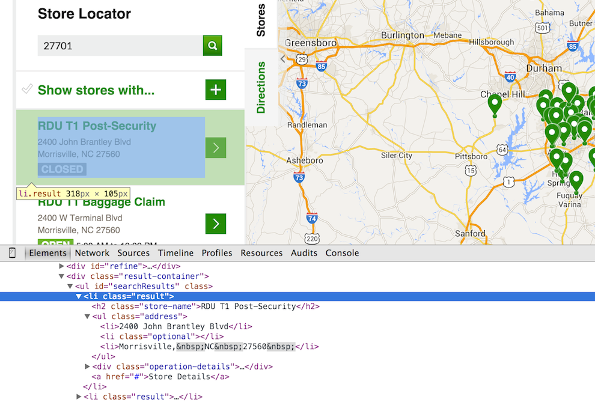

## Setup

```{r}
source("check_packages.R")
check_packages(c("httr","XML","stringr","jsonlite"))
```

## Attempt 1

First we will attempt to download data for the Durham area using 27701 zip.

```{r}
zip = 27701
url = paste0("http://www.starbucks.com/store-locator/search/location/",zip)

dir.create("html/", showWarnings = FALSE)

file = paste0("html/",zip,".html")
write(content(GET(url), as="text"), file=file)
```

If we examine the web page using Chrome's Developer tools we can get an idea where in the html file the data we want is.

<br/>
<div style="text-align:center; width:800px">

</div>
<br/>

It appears that each location is contained in a series of `<li class="result">` tags within the `<ul id="searchResults" class="">` tag. Our goal is then to extract these specific tags and then dump their values. We will use the `XML` package to handle the parsing of the html and searching for the appropriate tag(s). We search for the `ul` tags with the `id="searchResults"` attribute using the `getNodeSet` function. 

```{r}
d = xmlRoot(htmlParse(file))
ul = getNodeSet(d, "//ul[@id='searchResults']")
```

```{r}
ul
str(ul)
```

It appears that something has gone wrong, we have what looks like the correct `ul` tag but the data doesnt appear to be there.


## Attempt 2

So our first attempt appears to have failed, the data isn't there when we went to parse the html. If we play with the website a bit more in Chrome we can see why this may be - the location data does not appear to be loaded until the Store button is clicked on.

Behind the scenes the website is using AJAX and Javascript to asyncronously load the data only when it is needed. This clicking behavior is easy to accomplish inside a brower, but it isn't possible using tools like `httr`. As such we need an alternative approach to get the data, clearly it is coming from somewhere and we can use Chrome to find our where.

First we will load the Store locator web page, once it has loaded we open the Developer tools and switch to the network tool. After clearing all the entries we can click Stores link and observe any new connections that occur.

We see a call to a url that looks something like,

```
https://openapi.starbucks.com/v1/stores/nearby?callback=jQuery17208834315296262503_1411349607147&radius=50&limit=50&latLng=35.37538467194457%2C-79.28372712500004&ignore=storeNumber%2CownershipTypeCode%2CtimeZoneInfo%2CextendedHours%2ChoursNext7Days&brandCodes=SBUX&access_token=3mrq93gq8m8347stk5ck99a9&_=1411349885653
```

the contents of which look something like

```
jQuery17208834315296262503_1411349607147({  
   "paging":{  
      "total":73,
      "offset":0,
      "limit":50,
      "returned":50
   },
   "stores":[  
      {  
         "distance":16.7367,
         "store":{  
            "id":"17907",
            "name":"Aberdeen, NC",
            "brandName":"Starbucks",
            "phoneNumber":"910-692-2351",
            "operatingStatus":{  
               "operating":true,
               "openDate":"12/1/2006 12:00:00 AM",
               "closeDate":null,
               "status":"ACTIVE"
            },
            "address":{  
               "streetAddressLine1":"110 Columbus Drive",
               "streetAddressLine2":null,
               "streetAddressLine3":"Aberdeen Commons",
               "city":"Aberdeen",
               "countrySubdivisionCode":"NC",
               "countryCode":"US",
               "postalCode":"283152387"
            },
            "coordinates":{  
               "latitude":35.1571,
               "longitude":-79.4133
            },
            "features":[  
               {

...
```

Therefore, we can download data from the Starbucks API by manipulating this url.

```{r}
url = "https://openapi.starbucks.com/v1/stores/nearby?callback=jQuery17205138783170841634_1411418054835&radius=50&limit=50&latLng=35.9981205%2C-78.89204440000003&ignore=storeNumber%2CownershipTypeCode%2CtimeZoneInfo%2CextendedHours%2ChoursNext7Days&brandCodes=SBUX&access_token=ga3tyvj9bgmkyuezazw2cwzk&_=1411418073026"

d=GET(url)

stopifnot(d$status_code == 200)

file = paste0("json/",zip,".json")
write(content(d, as="text"), file=file)
```

as before we want to cache the files locally so that we don't need to make excessive calls to the API. We need to make a couple of small modifications to make sure that the JSON is valid and can itself be parsed.

```{r}
s = readLines(file)
stopifnot(length(s) == 1)

s = str_replace(s, "jQuery[0-9_]+\\(","")
s = str_replace(s, "}\\)","}")  

j = fromJSON(s, simplifyDataFrame=FALSE)
```

Now we'll construct a data frame from the relevant entries

```{r}
build_address = function(x)
{
    x$countryCode = NULL
    x$city = paste(x$city, x$countrySubdivisionCode)
    x$countrySubdivisionCode = NULL

    paste(unlist(x),collapse=", ")
}

l=lapply(j$stores, 
         function(x)
         {
              data.frame(id = x$store$id,
                         name = x$store$name,
                         brandName = x$store$brandName,
                         phoneNumber = x$store$phoneNumber,
                         openDate = x$store$operatingStatus$openDate,
                         status = x$store$operatingStatus$status,
                         address = build_address(x$store$address),
                         lat = x$store$coordinates$latitude,
                         long = x$store$coordinates$longitude,
                         currency = x$store$currency,
                         stringsAsFactors=FALSE)
         }
)

l = do.call("rbind",l)
```


## Session Info

```{r}
sessionInfo()
```